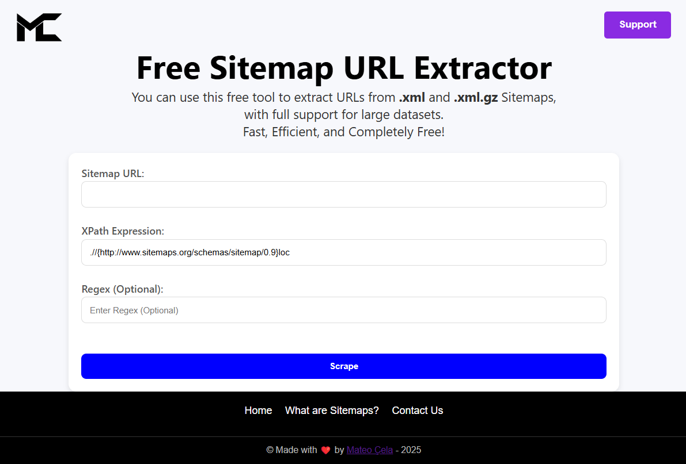

# XML-Scraper

`XML-Scraper` is a powerful web application built with Flask that allows users to scrape URLs from XML sitemaps easily. It extracts URLs based on an XPath expression, supports optional regex filtering, and provides multiple export options.

---

## 🌐 Live Demo

[>>> Click here <<<](https://xmlscraper.pythonanywhere.com/) to try the live demo.

---

## 🚀 Features

- Extract URLs from XML sitemaps using XPath.
- Filter extracted URLs using a regex pattern.
- Paginate and preview extracted URLs.
- Download extracted data in CSV, Excel, or PDF format.
- User-friendly and responsive interface.

---

## Screenshots 📸

  
*Example: XML-Scraper in action.*

---

## 📜 Requirements

Make sure you have the following installed:

- Python 3.x

- Flask

- requests

- pandas

- openpyxl

- reportlab

---

## 📥 Installation

Clone the repository:

```bash
git clone https://github.com/mateo1mc/xml-scraper.git
cd xml-scraper
```

Install dependencies:

```bash
pip install -r requirements.txt
```

Run the Flask server:

```bash
python app.py
```

Open the application in your browser:

`http://127.0.0.1:5000`

---

# 📖 Usage Guide

## 🔍 Scraping URLs

- Enter the URL of the XML sitemap you want to scrape.
- Provide an XPath expression to locate the URLs (default: `.//{http://www.sitemaps.org/schemas/sitemap/0.9}loc`).
- Optionally, enter a regex pattern to filter URLs.
- Click the "Scrape" button to extract and display URLs.

---

## 📑 Pagination

- Navigate through scraped URLs using pagination controls.
- Adjust the number of rows displayed per page dynamically.

---

## 📂 Download Options

Once URLs are scraped, you can download them in different formats:

- CSV - Click the "Download CSV" button.
- Excel (XLSX) - Click the "Download Excel" button.
- PDF - Click the "Download PDF" button.

---

## 📂 Project Structure

```
xml-scraper/
│
├── app.py                # Main Flask application
├── requirements.txt      # Dependencies
├── templates/            # HTML templates
│   ├── footer.html
│   ├── index.html
│   └── sitemaps.html
├── static/               # Static assets (CSS, JavaScript, images)
│   ├── footer.css
│   ├── mc-logo-black.png
│   ├── scraper.js
│   └── styles.css
└── README.md             # Project documentation
```

---

## 📜 License

This project is licensed under the MIT License - see the [LICENSE](https://github.com/mateo1mc/XML-Scraper/blob/46e0d2b93f3465bf34ea4ceae5b4779385c41279/LICENSE) file for details.

**If you find this project useful, consider giving it a ⭐ on GitHub! 🚀**

---

## Contact 📧

If you have any questions or suggestions, feel free to reach out:

<p align="center">
  <a href="https://www.linkedin.com/in/mateo1mc/" target="blank"></a>
  <a href="https://github.com/mateo1mc/" target="blank"></a>
</p> 

---

<h2 align = "center">Support Me</h2>
<p align="center">
<!--   <a href="https://www.buymeacoffee.com/mateo1mc" target="_blank"> -->
    <a href="https://www.paypal.com/paypalme/mateo1mc" target="_blank">
  </a>
</p>

---
